# Business-Analytics_3, Anomaly Detection 

## # Isolation Forest # Local Outlier Factor # Dimensionality Reduction

## Tutorial Purposes
1. Apply isolation forest w/ and w/o sklearn to three real-world datasets which has different number of variables.

2. Apply Local Outlier Factor w/ and w/o sklearn to three real-world datasets which has different number of variables.

3. Conduct dimensionality reduction and apply isolation forest and LOF for each dataset

4. Demonstrate whether dimensionality reduction can help anomaly detection performance of isolation forest


## Dataset
### Japanses Vowels Dataset
Data Link: http://odds.cs.stonybrook.edu/japanese-vowels-data/

The smallest dataset with 13 columns 

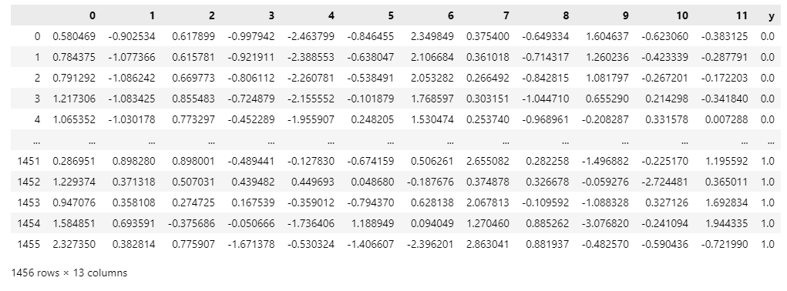

y values: 0 - 1406 / 1- 50, includes approximately 3.43% anomaly
***
### Credit Card Fraud Dataset
Data Link: https://www.kaggle.com/datasets/mlg-ulb/creditcardfraud

Medium size dataset with 30 columns, but huge number of samples.

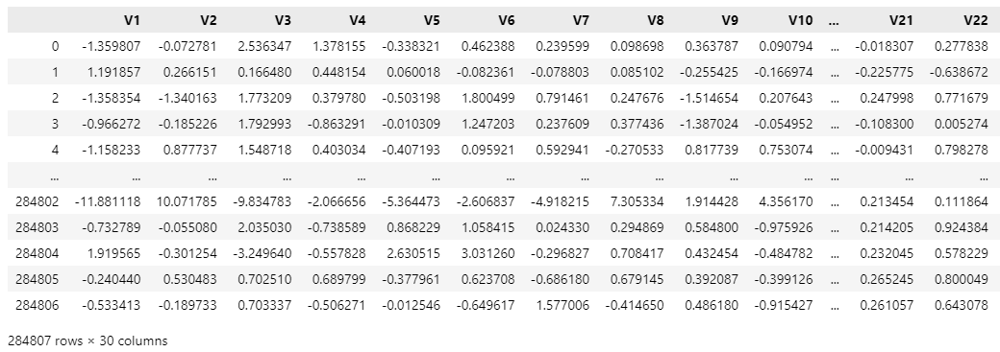

y values: 0 - 284315 / 1- 492, includes approximately 0.173% anomaly
***
### Optdigits Dataset
Data Link: http://odds.cs.stonybrook.edu/optdigits-dataset/

Dataset with the largest number of columns, 65 columns.

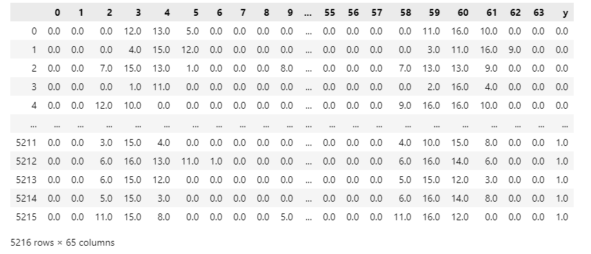

y values: 0 - 5066 / 1- 150, includes approximately 2.88% anomaly

## Step 1- Isolation Forest From Scratch 

**Selection a feature of the data**
```
def select_feature(data):
    return random.choice(data.columns)
```

**Select a random value within the range**
```
def select_value(data, feat):
    mini = data[feat].min()
    maxi = data[feat].max()
    return (maxi-mini)*np.random.random()+mini
```

**Split Data**
```
def split_data(data, split_column, split_value):
    data_below = data[data[split_column] <= split_value]
    data_above = data[data[split_column] > split_value]

    return data_below, data_above
```

**Classification**
```
def classify_data(data):

    label_column = data.values[:,]
    unique_classes, counts_unique_classes = np.unique(label_column, return_counts=True)

    index = counts_unique_classes.argmax()
    classification = unique_classes[index]

    return classification
```

**The isolation tree**
```
def isolation_tree(data, counter=0, max_depth=50):
    if data.empty ==False: 
        # End Loop if max depth or isolated
        if (counter == max_depth) or data.shape[0] == 1:
            classification = classify_data(data)
            return classification
        else:
            # Counter
            counter += 1

            # Select feature
            split_column = select_feature(data)

            # Select value
            split_value = select_value(data, split_column)
            # Split data
            data_below, data_above = split_data(data, split_column, split_value)

            # instantiate sub-tree
            question = "{} <= {}".format(split_column, split_value)
            sub_tree = {question: []}

            # Recursive part
            below_answer = isolation_tree(data_below, counter, max_depth=max_depth)
            above_answer = isolation_tree(data_above, counter, max_depth=max_depth)

            if below_answer == above_answer:
                sub_tree = below_answer
            else:
                sub_tree[question].append(below_answer)
                sub_tree[question].append(above_answer)

        return sub_tree
```

**Isolation forest**
```

def isolation_forest(df, n_trees, max_depth, subspace):
    forest = []
    for i in range(n_trees):
        # Sample the subspace
        if subspace <= 1:
            df = df.sample(frac=subspace)
        else:
            df = df.sample(subspace)
        # Fit tree
        tree = isolation_tree(df, max_depth=max_depth)

        # Save tree to forest
        forest.append(tree)

    return forest
```

**Anomaly score**
```
# Evaluate Distance

def evaluate_instance(instance, forest):
    paths = []
    for tree in forest:
        paths.append(pathLength(instance, tree))
    return paths

# C_factor

def c_factor(n):
    return 2.0*(np.log(n-1)+0.5772156649) - (2.0*(n-1.)/(n*1.0))

# Anomaly Score

def anomaly_score(data_point, forest, n):
    '''
    Anomaly Score

    Returns
    -------
    0.5 -- sample does not have any distinct anomaly
    0 -- Normal Instance
    1 -- An anomaly
    '''
    # Mean depth for an instance
    E = np.mean(evaluate_instance(data_point, forest))

    c = c_factor(n)

    return 2**-(E/c)
```

**Conduct isolation forest w/o sklean**
```
def IF_Scratch():
    names = ['data_1', 'data_2', 'data_3']
    acc_lst = []
    p_lst = []
    r_lst = []
    f_lst = []

    for name in names:
        data = pd.read_csv(f'./data/{name}.csv'.format(name))
        X = data.iloc[:, :-1]
        y = data.iloc[:, -1]

        iForest = isolation_forest(X, n_trees=20, max_depth=100, subspace=256)
        an = []
        for i in range(X.shape[0]):
            an.append(anomaly_score(X.iloc[[i]], iForest, 256))

        an = np.array(an)
        an[an >= 0.5] = 1
        an[an < 0.5] = 0

        acc = accuracy_score(y, an)
        p = precision_score(y, an)
        r = recall_score(y, an)
        f = f1_score(y, an)

        acc_lst.append(acc)
        p_lst.append(p)
        r_lst.append(r)
        f_lst.append(f)

        cf = confusion_matrix(y, an)
        print(cf)

    result = pd.DataFrame({'data': names, 'accuracy': acc_lst,
                        'precision_score': p_lst, 'recall_score': r_lst, 'f1_score': f_lst})

    result.to_csv('./results/scratch.csv', index=False)

IF_Scratch()
```
## Step 1 Result

The result table of the scratch isolation forest algorithm is below. 

|data|accuracy|precision_score|recall_score|f1_score|
|-|-|-|-|-|
|data_1|0.8633|0.1535|0.6600|0.2491|
|data_2|0.9343|0.0227|0.8801|0.0443|
|data_3|0.9049|0.0057|0.0133|0.0080|

According to the table, data_2 has the highest accuracy and recall_score. We would consider this result as our baseline. Since these datasets are about anomaly detection, we can say that there are maajor categories that we should pay attention to. In that case, the f1 score is more important than other scores. Thus, when acc and f1 were considered together, data 1 has the highest performance.


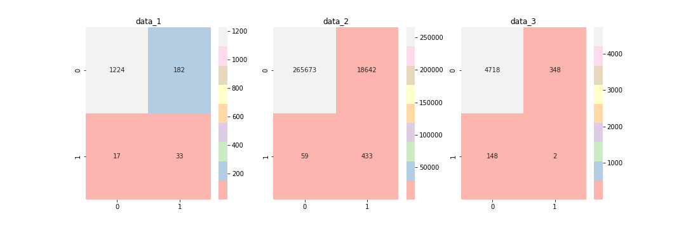


## Step 2 - Isolation Forest with sklearn and GridSearch 

**Isolation Forest with Sklearn and Gridsearch**
```
from sklearn.ensemble import IsolationForest
from sklearn.model_selection import GridSearchCV
from sklearn.model_selection import train_test_split

def IF_Search():
    names = ['data_1', 'data_2', 'data_3']
    acc_lst = []
    p_lst = []
    r_lst = []
    f_lst = []
    for name in names:
        data = pd.read_csv(f'./data/{name}.csv'.format(name))
        X = data.iloc[:, :-1]
        y = data.iloc[:, -1]
            
        model = IsolationForest(random_state=42)

        X_train, X_test, y_train, y_test = train_test_split(X, y, stratify=y, random_state=42)

        param_grid = {'n_estimators': [1000, 1500], 
                    'max_samples': [10], 
                    'contamination': ['auto', 0.001, 0.005, 0.01, 0.02, 0.03], 
                    'max_features': [10, 15], 
                    'bootstrap': [True], 
                    'n_jobs': [-1]}

        grid_search = GridSearchCV(model,param_grid,scoring="accuracy", refit=True,cv=10, return_train_score=True)

        grid_search.fit(X_train, y_train)
        
        best_params = grid_search.best_params_
        print(f"Best params: {best_params}")
        
        if_clf = IsolationForest(**best_params)
        if_clf.fit(X_train, y_train)

        y_pred = if_clf.fit_predict(X)
        an = np.where(y_pred<=-1,1,0)
        
        acc = accuracy_score(y, an)
        p = precision_score(y, an)
        r = recall_score(y, an)
        f = f1_score(y, an)

        acc_lst.append(acc)
        p_lst.append(p)
        r_lst.append(r)
        f_lst.append(f)

        cf = confusion_matrix(y, an)
        print(cf)

    result = pd.DataFrame({'data': names, 'accuracy': acc_lst,
                        'precision_score': p_lst, 'recall_score': r_lst, 'f1_score': f_lst})

    result.to_csv('./results/grid_search.csv', index=False)


IF_Search()
```

**Final Result with Best Hyperparameters**
```
def IF_run():
    names = ['data_1', 'data_2', 'data_3']
    acc_lst = []
    p_lst = []
    r_lst = []
    f_lst = []
    for name in names:
        data = pd.read_csv(f'./data/{name}.csv'.format(name))
        X = data.iloc[:, :-1]
        y = data.iloc[:, -1]
            
        if_clf =  IsolationForest(bootstrap=True, contamination=0.001, max_samples=10, n_estimators=1000, n_jobs=-1)
        y_pred = if_clf.fit_predict(X)
        an = np.where(y_pred<=-1,1,0)
        
        acc = accuracy_score(y, an)
        p = precision_score(y, an)
        r = recall_score(y, an)
        f = f1_score(y, an)

        acc_lst.append(acc)
        p_lst.append(p)
        r_lst.append(r)
        f_lst.append(f)

        cf = confusion_matrix(y, an)
        print(cf)

    result = pd.DataFrame({'data': names, 'accuracy': acc_lst,
                        'precision_score': p_lst, 'recall_score': r_lst, 'f1_score': f_lst})

    result.to_csv('./results/IF.csv', index=False)
    
IF_run()
```


## Step 2 Result

The best hyperparameters for each dataset are below. 

**Best hyperparameters**

|data|bootstrap|contamination|max_features|max_samples|n_estimators|n_jobs|
|-|-|-|-|-|-|-|
|data_1|True|0.001|10|10|1000|-1|
|data_2|True|0.001|10|10|1000|-1|
|data_3|True|0.001|10|10|1000|-1|

According to this table, we can figure out that there is no difference in best hyperparameters among datasets. 
Contamination is the proportion of outliers in the data set. Used when fitting to define the threshold on the scores of the samples. Although the proportion of anomaly is different, the best contamination records are the same which is interesting. 
Max_features is the number of features to draw from X to train each base estimator. Similar to contamination, although the number of columns is different, the best max_features records are the same. 
In addition, best max_samples are also same in all datasets.

We guess this is because there are enough columns and samples in each data. Thus, the hyperparameters affect not that much to the isolation forest algorithm.


Since the datasets we used had a large size, it took a long time for a grid search. To solve this problem, we sampled 0.2 fractures of each data and conducted grid search about those.

**Performance with sampled dataset**
|data|accuracy|precision_score|recall_score|f1_score|
|-|-|-|-|-|
|data_1|0.9656|0.0000|0.0000|0.0000|
|data_2|0.9971|0.0000|0.0000|0.0000|
|data_3|0.9664|0.0000|0.0000|0.0000|


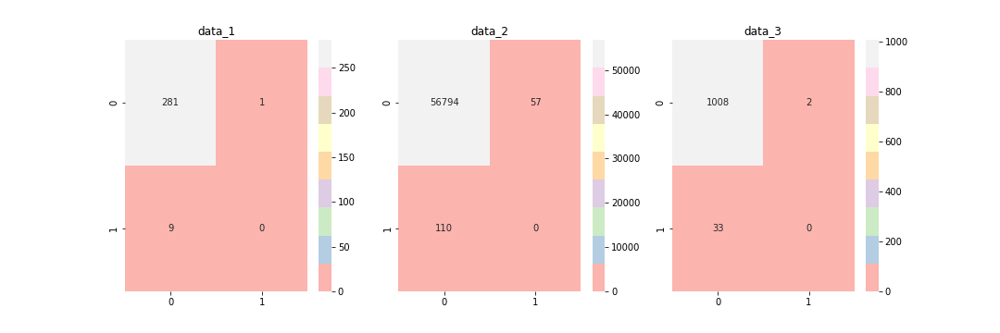

From grid search, we could figure out the best hyperparameters for each dataset, so we conduct an isolation forest algorithm with the best hyperparameters for each original dataset. 

**Performance with original dataset (best hyperparameters)**

|data|accuracy|precision_score|recall_score|f1_score|
|-|-|-|-|-|
|data_1|0.9643|0.0000|0.0000|0.0000|
|data_2|0.9979|0.2947|0.1707|0.2162|
|data_3|0.9705|0.1667|0.0067|0.0128|

According to this table, we could figure out that the anomaly detection performance of data_1 is 0. Although the accuracy of data_1 is quite high, there is no 'correct anomaly', so the precision score, recall score, and f1 score recorded zero. 

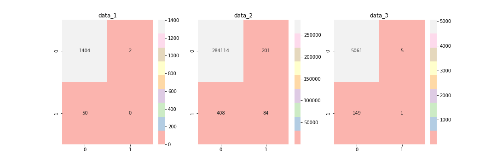
## Step 3 - Local Outlier Factor From Scratch 

**LOF From Scratch**
```
from sklearn.neighbors import NearestNeighbors

def LOF(X, k):

    knn = NearestNeighbors(n_neighbors=k)

    knn.fit(X)
    
    # Gather the kth nearest neighbor distance
    neighbors_and_distances = knn.kneighbors(X)
    knn_distances = neighbors_and_distances[0]
    neighbors = neighbors_and_distances[1]
    kth_distance = [x[-1] for x in knn_distances]
    
    local_reach_density = []
    for i in range(X.shape[0]):
        pt = X[i]
        sum_reachability = 0
        neighbor_distances = knn_distances[i]
        pt_neighbors = neighbors[i]
        for neighbor_distance, neighbor_index in zip(neighbor_distances, pt_neighbors):
            neighbors_kth_distance = kth_distance[neighbor_index]
            sum_reachability = sum_reachability + max([neighbor_distance, neighbors_kth_distance])
            
        avg_reachability = sum_reachability / k
        local_reach_density.append(1/avg_reachability)

    local_reach_density = np.array(local_reach_density)
    lofs = []
    for i in range(X.shape[0]):
        pt = X[i]
        avg_lrd = np.mean(local_reach_density[neighbors[i]])
        lofs.append(avg_lrd/local_reach_density[i])
        
    return lofs
```
**Run LOF From Scratch**
```
def run_LOF_scratch():
    names = ['data_1', 'data_2', 'data_3']
    acc_lst = []
    p_lst = []
    r_lst = []
    f_lst = []
    
    for name in names:
        data = pd.read_csv(f'./data/{name}.csv'.format(name))
        X = data.iloc[:, :-1].values
        y = data.iloc[:, -1]
        
        lof = LOF(X, 10)
        lof = np.array(lof)
        an = np.where(lof>=1.5,1,0)
        
        acc = accuracy_score(y, an)
        p = precision_score(y, an)
        r = recall_score(y, an)
        f = f1_score(y, an)

        acc_lst.append(acc)
        p_lst.append(p)
        r_lst.append(r)
        f_lst.append(f)

        cf = confusion_matrix(y, an)
        print(cf)

    result = pd.DataFrame({'data': names, 'accuracy': acc_lst,
                        'precision_score': p_lst, 'recall_score': r_lst, 'f1_score': f_lst})

    result.to_csv('./results/scratch_LOF.csv', index=False)

        
run_LOF_scratch()
```
## Step 3 Result 

The result table of the scratch LOF algorithm is below. We defined the threshold of low as 1.5 for all datasets.

|data|accuracy|precision_score|recall_score|f1_score|
|-|-|-|-|-|
|data_1|0.9650|0.4545|0.1000|0.1639|
|data_2|0.9559|0.0112|0.2805|0.0215|
|data_3|0.9705|0.1667|0.0067|0.0128|


According to the table, data_3 has the highest accuracy and recall_score. We would consider this result as our baseline. Since these datasets are about anomaly detection, we can say that there are maajor categories that we should pay attention to. In that case, the f1 score is more important than other scores. Thus, when acc and f1 were considered together, data 1 has the highest performance.


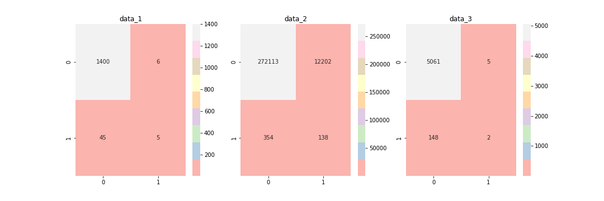

Comparing to the result of step 1, isolation forest from scratch,  the overall performance has increased. Especially, with data_1 and 2, the false alarm rate dropped sharply which is better for anomaly detection. 


## Step 4 LOF with sklearn and GridSearch 
**LOF with Sklearn and Gridsearch**
```
from sklearn.neighbors import LocalOutlierFactor
from sklearn.model_selection import GridSearchCV
from sklearn.model_selection import train_test_split

def LOF_Search():
    names = ['data_1', 'data_2', 'data_3']
    acc_lst = []
    p_lst = []
    r_lst = []
    f_lst = []
    for name in names:
        data = pd.read_csv(f'./data/{name}.csv'.format(name))
        X = data.iloc[:, :-1]
        y = data.iloc[:, -1]
            
        model = LocalOutlierFactor()

        X_train, X_test, y_train, y_test = train_test_split(X, y, stratify=y, random_state=42)

        param_grid = {'n_neighbors': [5, 10, 20, 30, 50], 
                    'p': [1, 2], 
                    'contamination': ['auto', 0.001, 0.005, 0.01, 0.02, 0.03], 
                    'n_jobs': [-1]}

        grid_search = GridSearchCV(model,param_grid,scoring="accuracy", refit=True,cv=10, return_train_score=True)

        grid_search.fit(X_train, y_train)
        
        best_params = grid_search.best_params_
        print(f"Best params: {best_params}")
        
        if_clf = LocalOutlierFactor(**best_params)
        if_clf.fit(X_train, y_train)

        y_pred = if_clf.fit_predict(X)
        an = np.where(y_pred<=-1,1,0)
        
        acc = accuracy_score(y, an)
        p = precision_score(y, an)
        r = recall_score(y, an)
        f = f1_score(y, an)

        acc_lst.append(acc)
        p_lst.append(p)
        r_lst.append(r)
        f_lst.append(f)

        cf = confusion_matrix(y, an)
        print(cf)

    result = pd.DataFrame({'data': names, 'accuracy': acc_lst,
                        'precision_score': p_lst, 'recall_score': r_lst, 'f1_score': f_lst})

    result.to_csv('./results/grid_search_LOF.csv', index=False)


LOF_Search()
```

**Final Result with Best Hyperparameters**

```
def LOF_run():
    names = ['data_1', 'data_2', 'data_3']
    acc_lst = []
    p_lst = []
    r_lst = []
    f_lst = []
    for name in names:
        data = pd.read_csv(f'./data/{name}.csv'.format(name))
        X = data.iloc[:, :-1]
        y = data.iloc[:, -1]
            
        if_clf = LocalOutlierFactor(n_neighbors=5, p=1, contamination='auto', n_jobs=-1)
        y_pred = if_clf.fit_predict(X)
        an = np.where(y_pred<=-1,1,0)
        
        acc = accuracy_score(y, an)
        p = precision_score(y, an)
        r = recall_score(y, an)
        f = f1_score(y, an)

        acc_lst.append(acc)
        p_lst.append(p)
        r_lst.append(r)
        f_lst.append(f)

        cf = confusion_matrix(y, an)
        print(cf)

    result = pd.DataFrame({'data': names, 'accuracy': acc_lst,
                        'precision_score': p_lst, 'recall_score': r_lst, 'f1_score': f_lst})

    result.to_csv('./results/LOF.csv', index=False)
    
LOF_run()
```
## Step 4 Result

The best hyperparameters for each dataset are below. 


**Best hyperparameters**
|data|n_neighbors|p|contamination|n_jobs|
|-|-|-|-|-|
|data_1|5|1|auto|-1|
|data_2|5|1|auto|-1|
|data_3|5|1|auto|-1|

According to this table, we can figure out that there is no difference in best hyperparameters among datasets. 
Contamination is the proportion of outliers in the data set. Used when fitting to define the threshold on the scores of the samples. Although the proportion of anomaly is different, the best contamination records are the same which is interesting.
Hyperparameter p defines the type of distance that we use. When p=1, it is equivalent to using manhattan distance (l1) and euclidean_distance(l2) for p=2. Thus, manhattan distance fits well to all datasets because the best hyperparameter p is 1 in all datasets.
Lastly, the best number of neighbors are all the same as 5. We gave n_neighbors as [5, 10, 20, 30, 50], so the lowest one became the best. From this result, we could conclude that the lower number of neighbors, the higher the anomaly detection performance.


We guess this is because there are enough columns and samples in each data. Thus, the hyperparameters affect not that much to the local outlier factor algorithm.

Since the datasets we used had a large size, it took a long time for a grid search. To solve this problem, we sampled 0.2 fractures of each data and conducted grid search about those.

**Performance with sampled dataset**
|data|accuracy|precision_score|recall_score|f1_score|
|-|-|-|-|-|
|data_1|0.9381|0.0000|0.0000|0.0000|
|data_2|0.9082|0.0006|0.0341|0.0011|
|data_3|0.9616|0.0000|0.0000|0.0000|

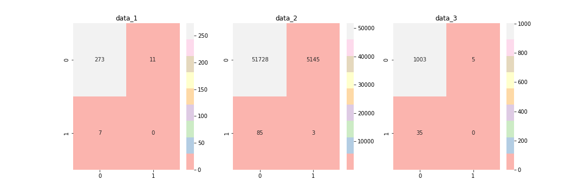

From grid search, we could figure out the best hyperparameters for each dataset, so we conduct an local outlier factor algorithm with the best hyperparameters for each original dataset. 

**Performance with original dataset (best hyperparameters)**
|data|accuracy|precision_score|recall_score|f1_score|
|-|-|-|-|-|
|data_1|0.9670|0.6667|0.0080|0.1429|
|data_2|0.9060|0.0044|0.2358|0.0086|
|data_3|0.9659|0.0000|0.0000|0.0000|

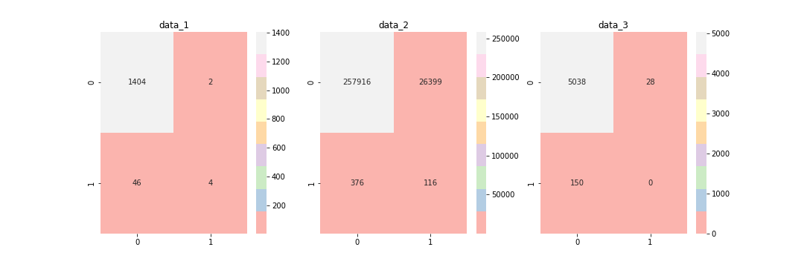
## Step 5 - Dimensionality Reduction with PCA 

**Plotting PCA with 3 Components**
```
# Import libraries
import numpy as np
import pandas as pd
import seaborn as sns
import matplotlib.pyplot as plt

from sklearn.ensemble import IsolationForest
from sklearn.preprocessing import StandardScaler
from sklearn.decomposition import PCA
from mpl_toolkits.mplot3d import Axes3D

def PCA_plotting_3d():
    names = ['data_1', 'data_2', 'data_3']

    for name in names:
        data = pd.read_csv(f'./data/{name}.csv'.format(name))
        X = data.iloc[:, :-1]
        y = data.iloc[:, -1]
        
        pca = PCA(n_components=3)
        scaler = StandardScaler()
        X = scaler.fit_transform(X)
        result = pca.fit_transform(X)
        
        df_pca = pd.DataFrame(result, columns = ['component 0', 'component 1','component 2'])
        df_pca['class'] = y 
        
        fig2 = plt.figure(figsize=(15,15))
        ax2 = fig2.add_subplot(111, projection='3d')

        ax2.set_xlabel('Principal Component 1', fontsize = 15)
        ax2.set_ylabel('Principal Component 2', fontsize = 15)
        ax2.set_zlabel('Principal Component 3', fontsize = 15)
        ax2.set_title('3 Component PCA', fontsize = 20)

        colors = ["#7fc97f","#beaed4"]
        for label, color in zip(y.unique(), colors):
            indicesToKeep = df_pca['class'] == label
            ax2.scatter(df_pca.loc[indicesToKeep, 'component 0']
                        , df_pca.loc[indicesToKeep, 'component 1']
                        , df_pca.loc[indicesToKeep, 'component 2']
                        , c = color
                        , s = 30)

        ax2.legend(y.unique())
        ax2.grid()
        
        plt.savefig(f'./pics/{name}_3D.png'.format(name))
        df_pca.to_csv(f'./results/{name}_3D.csv'.format(name),index=False)

PCA_plotting_3d()
```
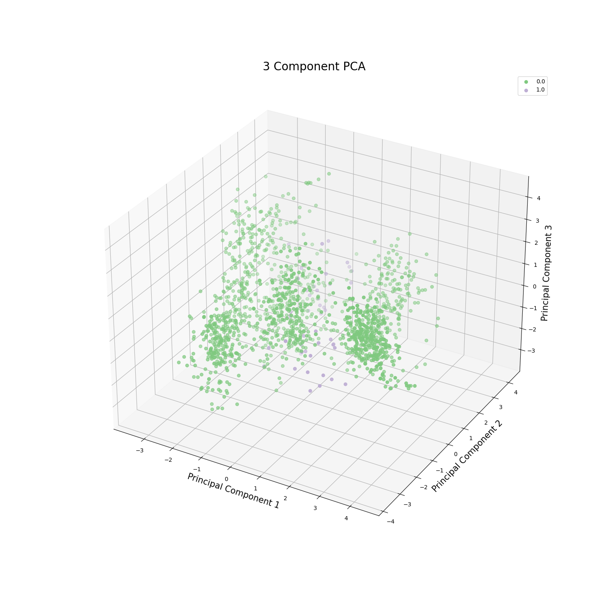
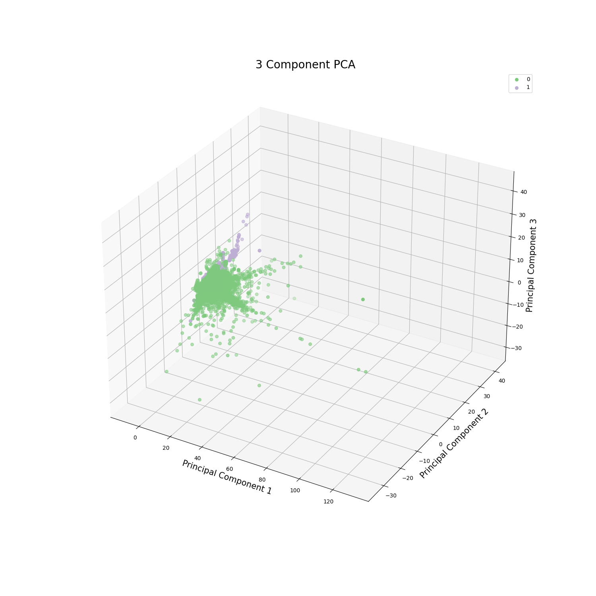
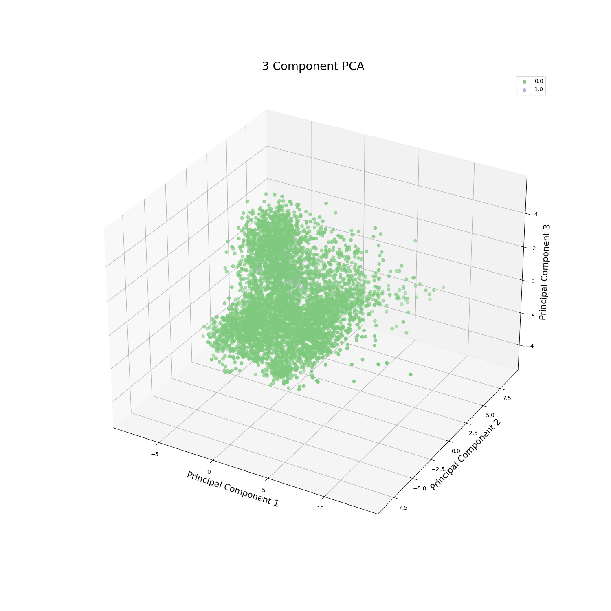

**Plotting PCA with 2 Components**
```

def PCA_plotting_2d():
    names = ['data_1', 'data_2', 'data_3']

    for name in names:
        data = pd.read_csv(f'./data/{name}.csv'.format(name))
        X = data.iloc[:, :-1]
        y = data.iloc[:, -1]
        
        pca = PCA(n_components=2)
        scaler = StandardScaler()
        X = scaler.fit_transform(X)
        result = pca.fit_transform(X)
        
        df_pca = pd.DataFrame(result, columns = ['component 0', 'component 1'])
        df_pca['class'] = y 
        
        fig2 = plt.figure(figsize=(15,15))
        ax2 = fig2.add_subplot(1,1,1)

        ax2.set_xlabel('Principal Component 1', fontsize = 15)
        ax2.set_ylabel('Principal Component 2', fontsize = 15)
        ax2.set_title('2 Component PCA', fontsize = 20)

        colors = ["#7fc97f","#beaed4"]
        for label, color in zip(y.unique(), colors):
            indicesToKeep = df_pca['class'] == label
            ax2.scatter(df_pca.loc[indicesToKeep, 'component 0']
                        , df_pca.loc[indicesToKeep, 'component 1']
                        , c = color
                        , s = 50)

        ax2.legend(y.unique())
        ax2.grid()
        
        plt.savefig(f'./pics/{name}_2D.png'.format(name))
        df_pca.to_csv(f'./results/{name}_2D.csv'.format(name),index=False)
        
        
PCA_plotting_2d()
```
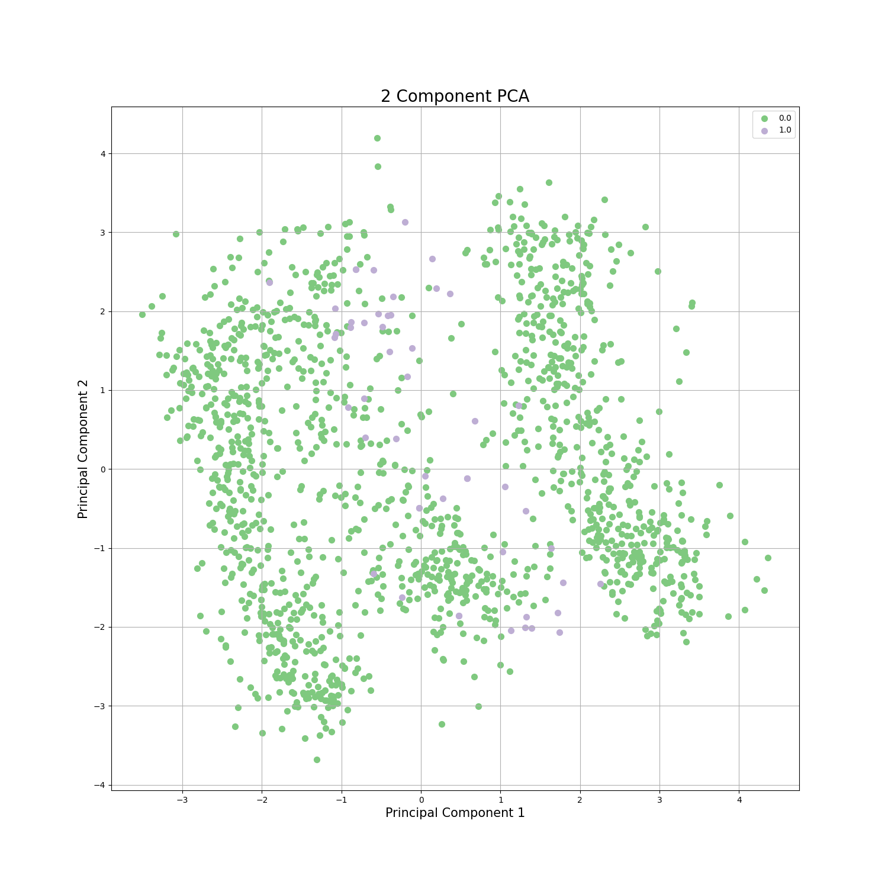
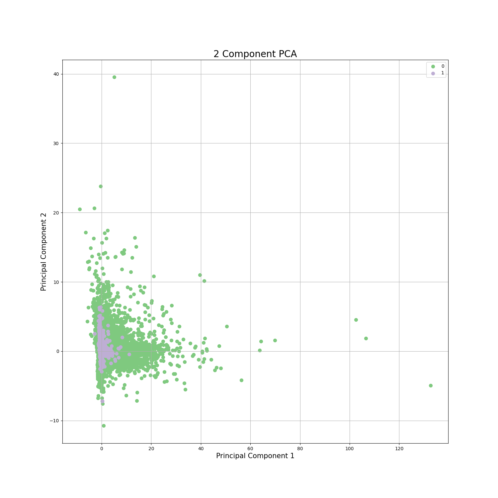
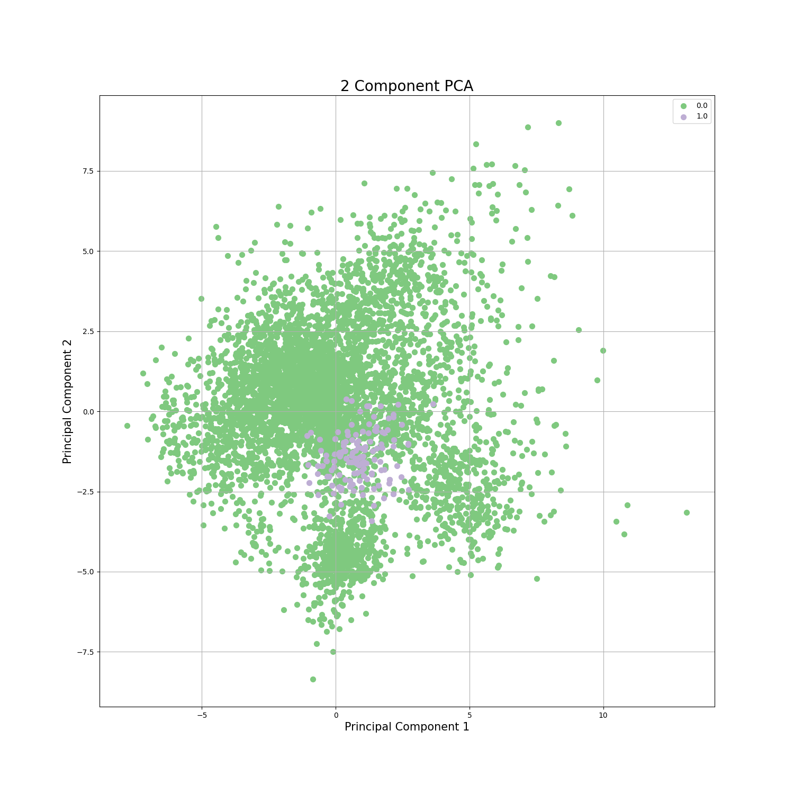


## Step 5 Result 

With those figures above, we could find out three things. 
First, data_2 is distributed with much higher dense than others. Both 3, and 2 components of PCA, there is a strong tendency to gather on both dimensions.

Second, the anomaly of data_3 has the weakest characteristics, which means it seems hard to detect the anomaly. Unlike other figures, anomaly samples are mixed with normal samples. 

Third, the principal components of data_1 are better distributed than others. In addition, the anomalies are concentrated in the center of the data. 

There was no big difference between components 3 and 2. Therefore, it can be assumed that there will be little difference in the animation detection performance depending on the type of PCA.

## Step 6 Isolation Forest & LOF With Principal Components 


**Apply Isolation Forest To Principal Components** 
```

def IF_dim():
    names = ['data_1', 'data_2', 'data_3']
    dims = ['2D', '3D']
    name_lst = []
    dim_lst = []
    acc_lst = []
    p_lst = []
    r_lst = []
    f_lst = []
    
    for name in names: 
        for dim in dims:
            data = pd.read_csv(f'./results/{name}_{dim}.csv'.format(name,dim))

            X = data.iloc[:, :-1]
            y = data.iloc[:, -1]

            if_clf = IsolationForest(bootstrap=True, contamination=0.001, max_samples=10, n_estimators=1000, n_jobs=-1)

            y_pred = if_clf.fit_predict(X)
            an = np.where(y_pred <= -1, 1, 0)

            acc = accuracy_score(y, an)
            p = precision_score(y, an)
            r = recall_score(y, an)
            f = f1_score(y, an)

            acc_lst.append(acc)
            p_lst.append(p)
            r_lst.append(r)
            f_lst.append(f)
            name_lst.append(name)
            dim_lst.append(dim)

            cf = confusion_matrix(y, an)
            print(cf)

        result = pd.DataFrame({'data':name_lst, 'dim':dim_lst, 'accuracy': acc_lst,
                                'precision_score': p_lst, 'recall_score': r_lst, 'f1_score': f_lst})

        result.to_csv('./results/IF_result.csv', index=False)

IF_dim()
```


**Apply LOF To Principal Components**
```
# Import libraries
from sklearn.metrics import confusion_matrix, accuracy_score, precision_score, recall_score, f1_score
import numpy as np
import pandas as pd
from sklearn.neighbors import LocalOutlierFactor

# LOF With Principal Components
def LOF_dim():
    names = ['data_1', 'data_2', 'data_3']
    dims = ['2D', '3D']
    acc_lst = []
    p_lst = []
    r_lst = []
    f_lst = []
    name_lst = []
    dim_lst = []
    for name in names: 
        for dim in dims:
            data = pd.read_csv(f'./results/{name}_{dim}.csv'.format(name,dim))

            X = data.iloc[:, :-1]
            y = data.iloc[:, -1]

            if_clf = LocalOutlierFactor(n_neighbors=5, p=1, contamination='auto', n_jobs=-1)

            y_pred = if_clf.fit_predict(X)
            an = np.where(y_pred <= -1, 1, 0)

            acc = accuracy_score(y, an)
            p = precision_score(y, an)
            r = recall_score(y, an)
            f = f1_score(y, an)

            acc_lst.append(acc)
            p_lst.append(p)
            r_lst.append(r)
            f_lst.append(f)
            name_lst.append(name)
            dim_lst.append(dim)
            cf = confusion_matrix(y, an)
            print(cf)

        result = pd.DataFrame({'data':name_lst, 'dim':dim_lst, 'accuracy': acc_lst,
                                'precision_score': p_lst, 'recall_score': r_lst, 'f1_score': f_lst})

        result.to_csv('./results/LOF_result.csv', index=False)

LOF_dim()
```

## Step 6 Result 
**Isolation Forest**
|data|dim|accuracy|precision_score|recall_score|f1_score|
|-|-|-|-|-|-|
|data_1|2D|0.9643|0.0000|0.0000|0.0000|
|data_1|3D|0.9643|0.0000|0.0000|0.0000|
|data_2|2D|0.9973|0.0000|0.0000|0.0000|
|data_2|3D|0.9973|0.0175|0.0102|0.0129|
|data_3|2D|0.9701|0.0000|0.0000|0.0000|
|data_3|3D|0.9701|0.0000|0.0000|0.0000|

 

**3D Confusion Matrix**
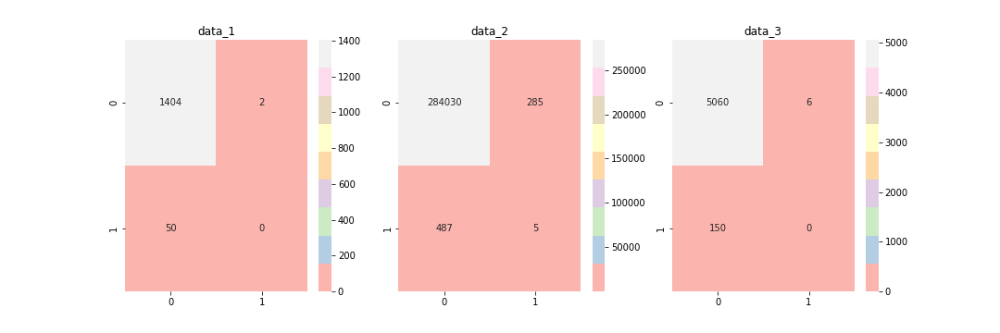

**2D Confusion Matrix**

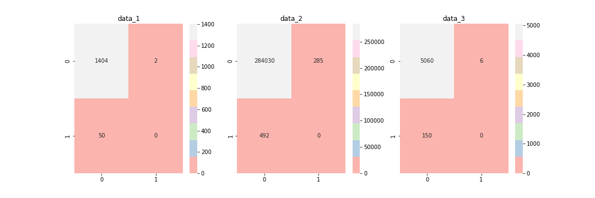

**Local Outlier Factor**

|data|dim|accuracy|precision_score|recall_score|f1_score|
|-|-|-|-|-|-|
|data_1|2D|0.9402|0.1064|0.1000|0.1031|
|data_1|3D|0.9334|0.0204|0.0200|0.0202|
|data_2|2D|0.9856|0.0006|0.0041|0.0010|
|data_2|3D|0.9778|0.0054|0.0650|0.0100|
|data_3|2D|0.9578|0.0000|0.0000|0.0000|
|data_3|3D|0.9548|0.0222|0.0133|0.0167|


From the table above, data_3 2D has anomaly detection ability. Although the accuracy of all cases is high, most models could not detect anomalies correctly. Compare to step4, the local outlier factor with the best hyperparameters, the detection ability has decreased a lot. It means dimension reduction does not help for increasing detection ability with those three datasets. Furthermore, there was only a little bit of performance difference between 2D and 3D as we assumed in previous step.


**3D Confusion Matrix**
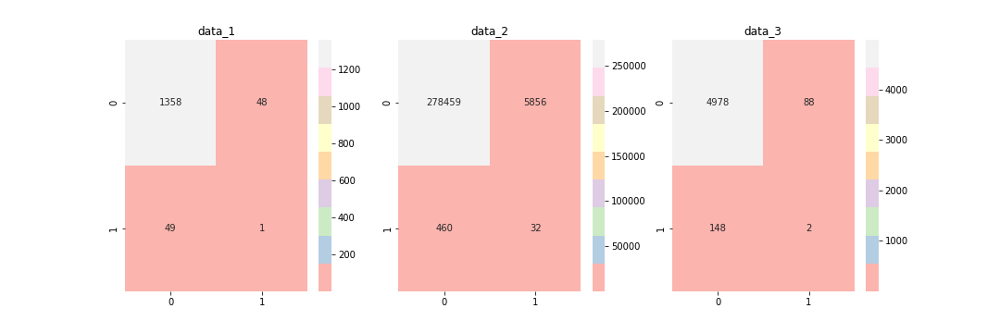

**2D Confusion Matrix**

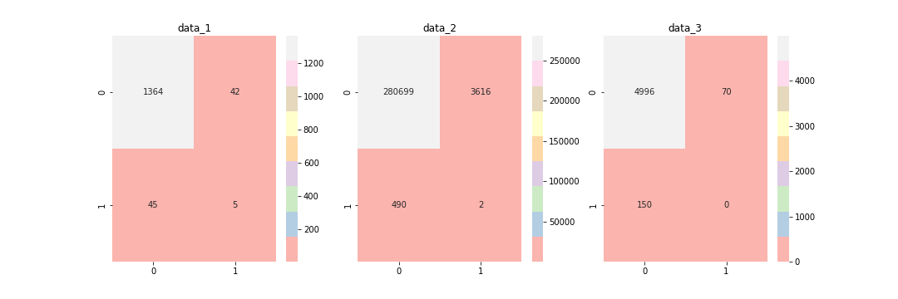


## Conclusion 

For evaluating anomaly detection ability, we would consider accuracy and f1 score simultaneously.

**Final Comparison Table For Data_1**
|data|algorithm|dim|accuracy|precision_score|recall_score|f1_score|
|-|-|-|-|-|-|-|
|data_1|IF_scratch|orginal|0.8633|0.1535|0.6600|0.2491|
|data_1|IF|orginal|0.9643|0.0000|0.0000|0.0000|
|data_1|IF|2D|0.9643|0.0000|0.0000|0.0000|
|data_1|IF|3D|0.9643|0.0000|0.0000|0.0000|
|data_1|LOF_scratch|orginal|0.9650|0.4545|0.1000|0.1639|
|data_1|LOF|orginal|0.9670|0.6667|0.0080|0.1429|
|data_1|LOF|2D|0.9402|0.1064|0.1000|0.1031|
|data_1|LOF|3D|0.9334|0.0204|0.0200|0.0202|


According to above table, isolation forest from scratch with original dataset recorded the highest anomaly detection performance. In addition, local outlier factor from scratch with original dataset also recorded high accuracy and f1 score. With this result, we can conclude that scratch codes are better than sklearn packages.

In this dataset, isolation forest has slightly better detecting performance than local outlier factor. We guess it is because japanese vowel dataset has 3.43% anomaly and its suitable for both algorithms.

As we checked with pca figures, data_1 is distributed well. So, it can fit well both density-based algorithm, local outlier factor, and model-based algorithm, isolation forest.

**Dataset 1**

Isolation forest from scratch 
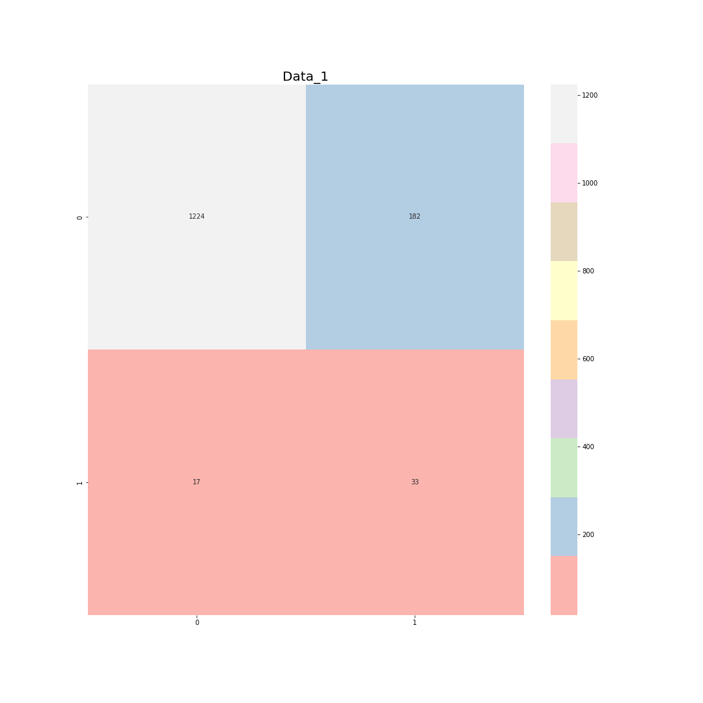

**Final Comparison Table For Data_2**
|data|algorithm|dim|accuracy|precision_score|recall_score|f1_score|
|-|-|-|-|-|-|-|
|data_2|IF_scratch|orginal|0.9343|0.0227|0.8801|0.0443|
|data_2|IF|orginal|0.9979|0.2947|0.1707|0.2162|
|data_2|IF|2D|0.9973|0.0000|0.0000|0.0000|
|data_2|IF|3D|0.9973|0.0175|0.0102|0.0129|
|data_2|LOF_scratch|orginal|0.9559|0.0112|0.2805|0.0215|
|data_2|LOF|orginal|0.9060|0.0044|0.2358|0.0086|
|data_2|LOF|2D|0.9856|0.0006|0.0041|0.0010|
|data_2|LOF|3D|0.9778|0.0054|0.0650|0.0100|

According to above table, isolation forest with best hyperparameters with original dataset recorded the highest anomaly detection performance. In addition, local outlier factor from scratch with original dataset also recorded high accuracy and f1 score. With this result, we can conclude that scratch code of local outlier factor better than sklearn package with this dataset.

In this dataset, isolation forest has slightly better detecting performance than local outlier factor. We guess it is because credit card fraud dataset has 0.173% anomaly and its suitable for both algorithms.

As we checked with PCA figures, data_2 is dense for components 2 and 3. So, it can fit better with a model-based algorithm, isolation forest. The local outlier factor is density-based, so it might be suitable for the 'not much dense' dataset.

Lastly, the credit card fraud dataset has a large volume. It has 284807 samples and 30 columns. Since it has a lot of samples for constructing isolation forests and local outlier factors, the overall accuracy is the highest among the three datasets.


**Dataset 2**

Isolation forest from scratch 
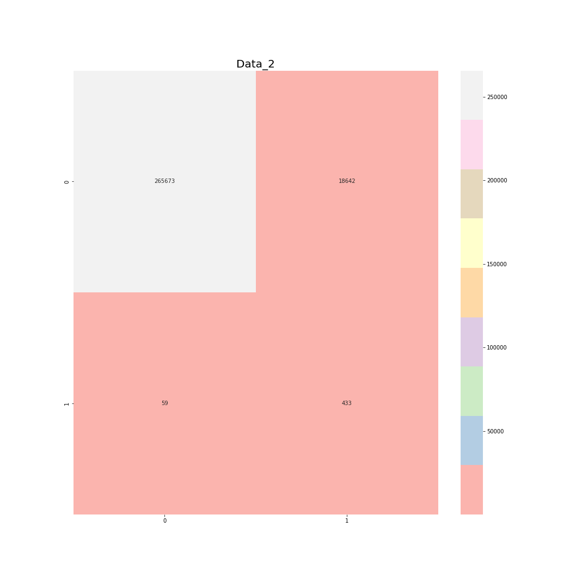


**Final Comparison Table For Data_3**
|data|algorithm|dim|accuracy|precision_score|recall_score|f1_score|
|-|-|-|-|-|-|-|
|data_3|IF_scratch|orginal|0.9049|0.0057|0.0133|0.0080|
|data_3|IF|orginal|0.9705|0.1667|0.0067|0.0128|
|data_3|IF|2D|0.9701|0.0000|0.0000|0.0000|
|data_3|IF|3D|0.9701|0.0000|0.0000|0.0000|
|data_3|LOF_scratch|orginal|0.9705|0.1667|0.0067|0.0128|
|data_3|LOF|orginal|0.9659|0.0000|0.0000|0.0000|
|data_3|LOF|2D|0.9578|0.0000|0.0000|0.0000|
|data_3|LOF|3D|0.9548|0.0222|0.0133|0.0167|

According to above table, the local outlier factor with 3 components PCA dataset recorded the highest anomaly detection performance. In addition, local outlier factor from scratch with original dataset and isolation forest with original dataest also recorded high accuracy and f1 score. Interestingly, two different model, IF and LOF, has same performance with origianl data_3 data.

In this dataset, the local outlier factor model has slightly better detecting performance than the isolation forest model. However, only half of the models have anomaly detection ability, so it is really important to choose the right model for this data.

As we checked with PCA figures, anomalies of data_3 do not have special features than others. We assume that's why the detecting ability is the lowest in this dataset.

Lastly, the optdigits dataset has a large number of columns. It has 65 columns. Therefore, it is the only one whose performance has improved after dimensionality reduction with PCA. Unlike data_3, others performance decreased with PCA components. 


**Dataset 3**
Isolation forest from scratch 
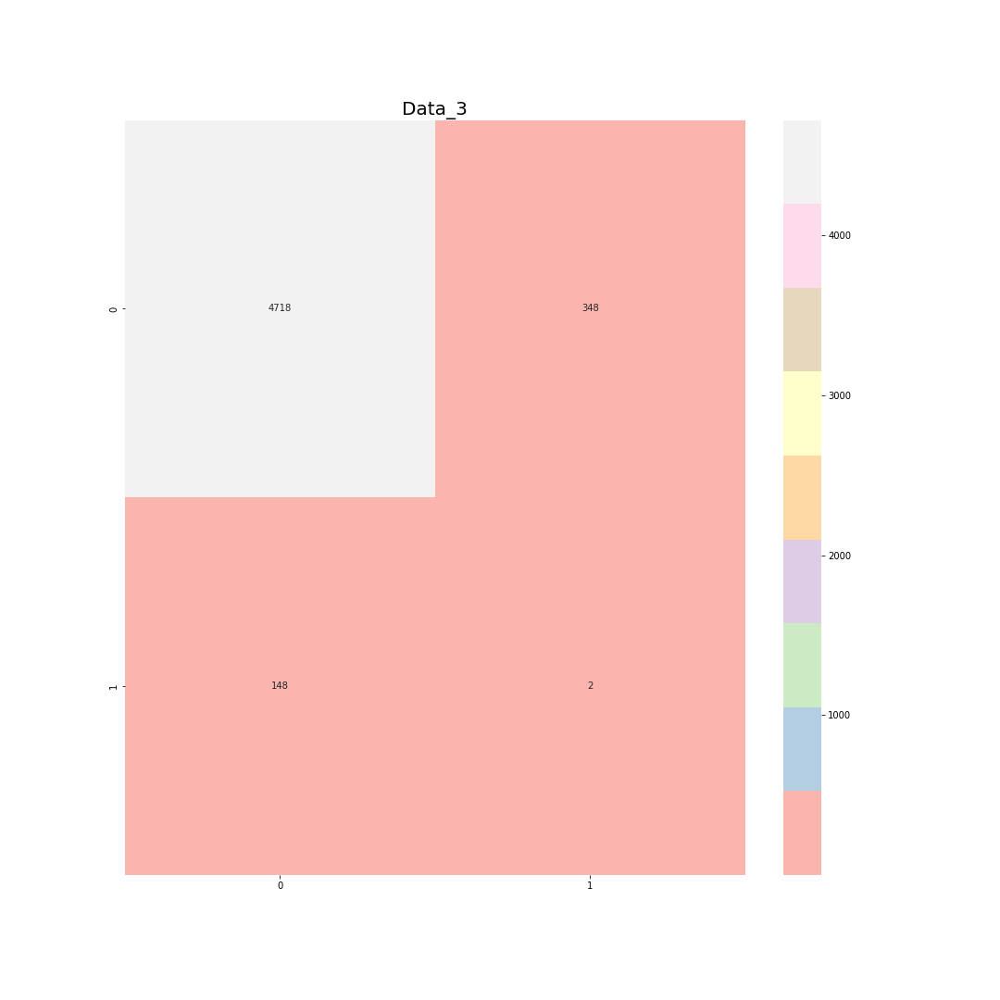

## Interesting Insights
### 1. Sklearn package is not always the answer. Sometimes, code from scratch can work better.

### 2. Actually, density-based and model-based anomaly detection algorithms have their place. If you have enough time, try both.

### 3. Dimensionality reduction really can help anoamly detection, but only when dataset has lots of columns. 
